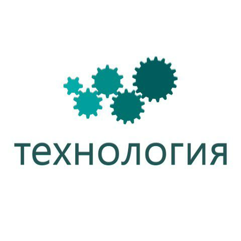
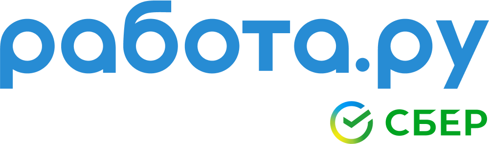
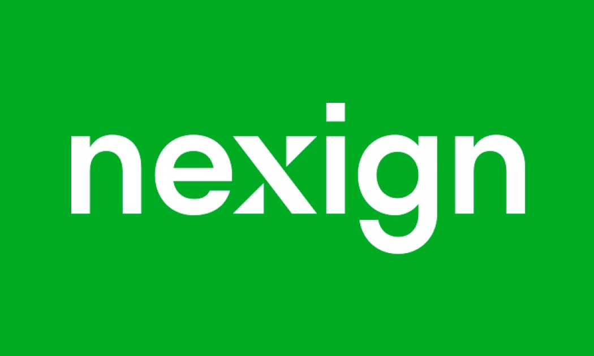
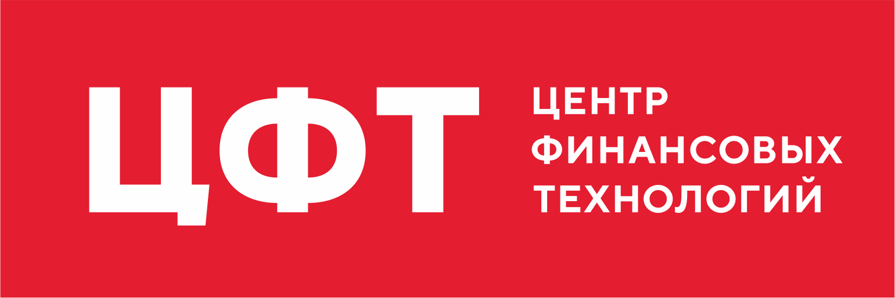

[](https://android-arsenal.com/details/1/7896)
[](http://androidweekly.net/issues/issue-383)
[](http://androidweekly.net/issues/issue-392)
[](https://search.maven.org/artifact/com.kaspersky.android-components/kaspresso)

[](https://t.me/kaspresso)
[](https://t.me/kaspresso_en)

# Kaspresso

Kaspresso is a great framework for UI testing. Based on [Espresso](https://developer.android.com/training/testing/espresso) and [UI Automator](https://developer.android.com/training/testing/ui-automator), Kaspresso provides a wide range of additional amazing features, such as:
* 100% stability, no flakiness.
* Jetpack Compose support **[Early access]**.
* Significantly faster execution of UI Automator commands.
With Kaspresso, some UI Automator commands run **10 times faster**!
* Excellent readability due to human DSL.
* Incredible mechanism of interceptors that allows you to catch all actions and assertions in one place.
* Full logging.
* Ability to call ADB commands.
* UI tests writing philosophy, implemented with DSL.
* Features screenshotting.
* Robolectric support.
* Allure support.

And many more!


## Visit our [site](https://kasperskylab.github.io/Kaspresso/Home/Kaspresso/) to get more info

## Capabilities of Kaspresso

### Readability

We like the syntax that [Kakao](https://github.com/KakaoCup/Kakao) applies to write UI tests. This wrapper over Espresso uses the Kotlin DSL approach, that makes the code significantly shorter and more readable. See the difference:

**Espresso**:
```kotlin
@Test
fun testFirstFeature() {
    onView(withId(R.id.toFirstFeature))
        .check(ViewAssertions.matches(
               ViewMatchers.withEffectiveVisibility(
                       ViewMatchers.Visibility.VISIBLE)))
    onView(withId(R.id.toFirstFeature)).perform(click())
}
```
**Kakao**:
```kotlin
@Test
fun testFirstFeature() {
    mainScreen {
        toFirstFeatureButton {
            isVisible()
            click()
        }
    }
}
```
We used the same approach to develop our own wrapper over UI Automator, and we called it *Kautomator*. Take a look at the code below:

**UI Automator**:
```kotlin
val instrumentation: Instrumentation = InstrumentationRegistry.getInstrumentation()
val uiDevice = UiDevice.getInstance(instrumentation)

val uiObject = uiDevice.wait(
    Until.findObject(
        By.res(
            "com.kaspersky.kaspresso.sample_kautomator",
            "editText"
        )
    ),
    2_000
)

uiObject.text = "Kaspresso"
assertEquals(uiObject.text, "Kaspresso")
```
**Kautomator**:
```kotlin
MainScreen {
    simpleEditText {
        replaceText("Kaspresso")
        hasText("Kaspresso")
    }
}
```
Since Kakao and Kautomator provide almost identical APIs, you don’t have to care about what is under the hood of your tests, either Espresso or UI Automator. With Kaspresso, you write the same tests for both.

Read about [Kakao](/docs/Wiki/01_Wrapper_over_Espresso.md) and [Kautomator](/docs/Wiki/02_Wrapper_over_UiAutomator.md) in details.

However, Kakao and Kautomator themselves don't help you to see the relation between the test and the corresponding test case. Also, a long test often becomes a giant piece of code that is impossible to split into smaller parts.
That's why we have created an additional Kotlin DSL that allows you to read your test more easily. 

See the example below:

```kotlin
@Test
fun shouldPassOnNoInternetScanTest() =
    beforeTest {
        // some things with the state
    }.afterTest {
        // some things with the state
    }.run {
        step("Open Simple Screen") {
            MainScreen {
                nextButton {
                    isVisible()
                    click()
                }
            }
        }

        step("Click button_1 and check button_2") {
            SimpleScreen {
                button1 {
                    click()
                }
                button2 {
                    isVisible()
                }
            }
        }

        step("Click button_2 and check edit") {
            SimpleScreen {
                button2 {
                    click()
                }
                edit {
                    flakySafely(timeoutMs = 7000) { isVisible() }
                    hasText(R.string.text_edit_text)
                }
            }
        }

        step("Check all possibilities of edit") {
            scenario(
                CheckEditScenario()
            )
        }
    }
```

### Stability 

Sometimes your UI test passes ten times, then breaks on the eleventh attempt for some mysterious reason. It’s called *flakiness*. 

The most popular reason for flakiness is the instability of the UI tests libraries, such as Espresso and UI Automator. To eliminate this instability, Kaspresso uses DSL wrappers and [interceptors](#Interceptors). 

Also, [some Kaspresso features](/docs/Wiki/04_How_to_write_autotests.md#sweet-additional-features) can help you resolve a lot of typical problems in UI testing.

### UI test libraries acceleration

Let’s watch some short video that shows the difference between the original UI Automator (on the right) and the accelerated one (on the left).


Here is [a short explanation](./docs/Wiki/02_Wrapper_over_UiAutomator.md#accelerate-ui-automator) of why it is possible.

<a name="Interceptors"></a>
### Interceptors

We developed [Kaspresso behavior interceptors](/docs/Wiki/03_Kaspresso_configurator.md#some-words-about-behavior-interceptors) on the base of [Kakao/Kautomator Interceptors](/docs/Wiki/03_Kaspresso_configurator.md#kaspresso-interceptors-based-on-kakaokautomator-interceptors) to catch failures.

Thanks to interceptors, you can do a lot of useful things, such as:
* add custom actions to each library operation like writing a log or taking a screenshot;
* overcome flaky library operations by re-running failed actions, scrolling the parent layout or removing the android system dialog;

and many more (see [the manual](/docs/Wiki/03_Kaspresso_configurator.md#kaspresso-interceptors-based-on-kakaokautomator-interceptors)).

### Writing readable logs
Kaspresso writes its own logs, detailed and readable:


### Ability to call ADB commands

Espresso and UI Automator don't allow to call ADB commands from inside a test. To fix this problem, we developed Autotest AdbServer (see the [wiki](./docs/Wiki/06_AdbServer.md)).

### Ability to work with Android System

You can use Kaspresso classes to work with Android System.

For example, with the ```Device``` class you can:
* push/pull files,
* enable/disable network,
* give permissions like a user does,
* emulate phone calls,
* take screenshots,
* enable/disable GPS,
* set geolocation,
* enable/disable accessibility,
* change the app language,
* collect and parse the logcat output.

(see more about the [Device class](/docs/Wiki/05_Device.md)).

### Features screenshotting

If you develop an application that is available across the world, you have to *localize* it into different languages. When UI is localized, it’s important for the translator to see the context of a word or a phrase, that is the specific screen. 

With Kaspresso, translators can automatically take a screenshot of any screen. It’s incredibly fast, even for legacy screens, and you don't have to refactor or mock anything (see [the manual](/docs/Wiki/07_DocLoc.md)).

### Configurability

You can tune any part of Kaspresso (read [more](/docs/Wiki/03_Kaspresso_configurator.md))

### Robolectric support

You can run your UI-tests on the JVM environment. Additionally, almost all interceptors improving stability, readability and other will work. 
Read [more](/docs/Wiki/08_Kaspresso-Robolectric.md). 

### Allure support

Kaspresso can generate very detailed Allure-reports for each test:

More information is available [here](/docs/Wiki/09_Kaspresso-Allure.md). 

### Jetpack Compose support (Early access)

Now, you can write your Kaspresso tests for Jetpack Compose screens! DSL and all principles are the same. 
So, you will not see any difference between tests for View screens and for Compose screens.
More information is available [here](/docs/Wiki/10_Jetpack-Compose.md).

**Keep in mind it's early access that may contain bugs. Also, API can be changed, but we are going to avoid it. Be free to create relative issues if you've encountered with any kind of problem.**

## Philosophy

The tool itself, even the perfect one, can not solve all the problems in writing UI tests. It’s important to know how to write tests and how to organize the entire process. Our team has great experience in introducing autotests in different companies. We shared our knowledge on [writing autotests](/docs/Wiki/04_How_to_write_autotests.md).

## Integration

To integrate Kaspresso into your project:
1. If the `mavenCentral` repository does not exist, include it to your root `build.gradle` file:

```groovy
allprojects {
    repositories {
        mavenCentral()
    }
}
```

2. Add a dependency to `build.gradle`:

```groovy
dependencies {
    androidTestImplementation 'com.kaspersky.android-components:kaspresso:<latest_version>'
    // Allure support
    androidTestImplementation "com.kaspersky.android-components:kaspresso-allure-support:<latest_version>"
    // Jetpack Compose support
    androidTestImplementation "com.kaspersky.android-components:kaspresso-compose-support:<latest_version>"
}
```

If you are still using the old Android Support libraries, we strongly recommend to migrate to AndroidX.

The last version with Android Support libraries is:

```groovy
dependencies {
    androidTestImplementation 'com.kaspersky.android-components:kaspresso:1.0.1-support'
}
```

## Wiki

For all information check [Kaspresso wiki](/docs/Wiki/)

## Tutorial

You can find tutorial [hear](https://kasperskylab.github.io/Kaspresso/Tutorial/simple_test/)

## Samples

All samples are available in the [samples](/samples) folder. 

Most of the samples require AdbServer. To start AdbServer you should do the following steps:
1. Go to the `Kaspresso` folder
```
cd ~/Workspace/Kaspresso
```
2. Start `adbserver-desktop.jar`
```
java -jar artifacts/adbserver-desktop.jar
```

## Breaking changes 

Breaking changes can be found [here](https://kasperskylab.github.io/Kaspresso/Home/Breaking-changes/)

## Storage issue

More details can be found [hear](https://kasperskylab.github.io/Kaspresso/Issues/Storage_issue/)

## Contribution
Kaspresso is an open source project, so you are welcome to contribute (see the [Contribution Guidelines](https://github.com/KasperskyLab/Kaspresso/blob/master/CONTRIBUTING.md)).

## License
Kaspresso is available under the [Apache License, Version 2.0](https://github.com/KasperskyLab/Kaspresso/blob/master/LICENSE).

## Our Users
<table>
 	<tr>
  		<td>
            <a href="https://www.kaspersky.ru"></a>
        </td>
        <td>
            <a href="https://hh.ru"></a>
        </td>
        <td>
            <a href="https://aliexpress.ru"></a>
        </td>
        <td>
            <a href="https://www.sber.ru"></a>
        </td>
        <td>
            <a href="https://www.revolut.com"></a>
        </td>
 	</tr>
 	<tr>
        <td>
            <a href="https://www.delivery-club.ru"></a>
        </td>
        <td>
            <a href="https://www.vtb.ru"></a>
        </td>
        <td>
            <a href="https://www.tinkoff.ru"></a>
        </td>
        <td>
            <a href="https://www.x5.ru"></a>
        </td>
        <td>
            <a href="https://www.zen.yandex.ru"></a>
        </td>
 	</tr>
 	<tr>
        <td>
            <a href="https://www.psbank.ru"></a>
        </td>
        <td>
            <a href="https://www.letoile.ru"></a>
        </td>
        <td>
            <a href="https://rtkit.ru"></a>
        </td>
        <td>
            <a href="https://ooo.technology"></a>
        </td>
        <td>
            <a href="https://www.blinkist.com"></a>
        </td>
 	</tr>
    <tr>
        <td>
            <a href="https://www.rabota.ru"></a>
        </td>
        <td>
            <a href="https://www.cian.ru"></a>
        </td>
        <td>
            <a href="https://squaregps.com"></a>
        </td>
        <td>
            <a href="https://nexign.com"></a>
        </td>
        <td>
            <a href="https://profi.ru"></a>
        </td>
 	</tr>
    <tr>
        <td>
            <a href="https://alohabrowser.com"></a>
        </td>
        <td>
            <a href="https://vivid.money"></a>
        </td>
        <td>
            <a href="https://www.raiffeisen.ru"></a>
        </td>
        <td>
            <a href="https://www.cft.ru"></a>
        </td>
        <td>
            <a href="https://www.superjob.ru"></a>
        </td>
    </tr>
</table>
