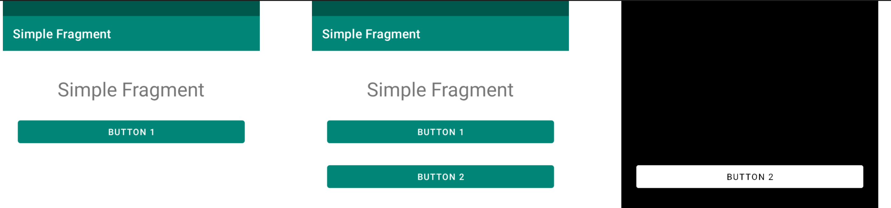

## Что такое попиксельное сравнение?

Этот вид тестов предполагает следующий процесс:
1) Вы пишете автотест, который приводит ваше приложение к определенному состоянию и делает скриншот
2) Первый запуск автотеста вы выполняете в режиме записи скриншотов. Скриншоты вы сохраняете в своей инфраструктуре.
3) Каждый последующий запуск автотеста вы выполняете в режиме сравнения. Автотест сравнивает скриншоты с
с предыдущего шага с новыми

Если различия между скриншотами не превышают пороговые значения, тест считается успешным. Если отличия превышают
предельные значения, то тест не проходит. В случае обнаружения отличий Kaspresso генерирует картинку, подсвечивающую различия между скриншотами.

В примере ниже первый скриншот - эталонный, второй - новый, а третий - результат сравнения.


## Как использовать по-пиксельное сравнение
### Код
Пример кода пожно посмотреть в [VisualTestSample.kt](https://github.com/KasperskyLab/Kaspresso/blob/master/samples/kaspresso-sample/src/androidTest/kotlin/com/kaspersky/kaspressample/visual/VisualTestSample.kt)

Ниже разберем ключевые моменты, на которые стоит обратить внимание.

Новый автотест должен быть наследником VisualTestCase:
```kotlin
class VisualTest : VisualTestCase() {
    // ...
}
```

Для описания теста вместо вызова before{}.after{}.run{} необходимо воспользоваться методом `runScreenshotTest`:
```kotlin
@Test
fun test() = runScreenshotTest {
    step("Open Simple Screen") {
        MainScreen {
            simpleButton {
                isVisible()
                click()
                assertScreenshot("some_tag")
            }
        }
    }
}
```
Если вам необходимо выполнить какие-либо действия до или после выполнения теста - передайте блоки before и 
after в `runScreenshotTest`:
```kotlin
@Test
fun test() = runScreenshotTest(
    before = {},
    after = {},
) {
    // Test code
}
```

Обратите внимание на вызов `assertScreenshot()`. Эта конструкция в режиме записи сохранит новый скриншот, 
а в режиме сравнения - сравнит его с эталонным.

### Запуск
Тесты сравнения скриншотов могут работать в двух режимах - `Record` и `Compare`. При необходимости записи эталонных скриншотов
используется режим `Record`. Когда тест готов - он запускается в режиме compare. На шаге, где в режиме `Record` происходила
запись скриншота теперь выполняется сравнение с эталоном. 

Есть 2 способа выбрать режим работы теста:
1) Вручную в коде, передавая параметр в конструктор VisualTestCase:
```kotlin
class VisualTestSample : VisualTestCase(
    kaspressoBuilder = Kaspresso.Builder.simple {
        visualTestParams = VisualTestParams(testType = VisualTestType.Record)
    }
)
```
2) Задать значение gradle property:
```groovy
kaspresso.visualTestType="Record"
```

**Важно** - перед запуском теста необходимо запустить adb server. О том как это сделать написано 
[здесь](Executing_adb_commands.ru.md)

После запуска теста в режиме записи, скриншоты будут сохранены в памяти устройства. По умолчанию они будут сохранены в папке
`/sdcard/Documents/original_screenshots/`. Полученные скриншоты вы должны сохранить где-то в своей инфрастуктуре. 
Легче всего будет поместить их в репозиторий рядом с исходниками приложения или сохранить там же, где вы храните jar файл adb-server'а.

Чтобы последующие запуски автотеста производили сравнение скриншотов, необходимо переключить режим проведения тестов 
в значение `Compare`. В случше, если между скриншотами будут найдены существенные отличия, Kaspresso сформирует папку 
`screenshot_diffs`, в которой будут лежать вспомогательные скриншоты с отличиями между эталонами и новыми скриншотами, а тест упадет.

## Как происходит сравнение
Каждый скриншот представляется в виде двухмерного массива. Каждое значение в массиве - это цвет пикселя.
Тест проходит по двум массивам (эталон и новый), сравнивает индивидуальные пиксели и считает отношение между 
количеством отличающихся пикселей и общего количества пикселей. 

Данный вид тестов необходимо запускать на одной и той же конфигурации устройств (предпочтительно на одном и том же AVD),
но даже в таком случае один и тот же тест может генерировать скриншоты, которые отличаются друг от друга несколькими пикселями.
В основном, это связано с особенностями рендера на разном железе. 

Чтобы решить эту проблему, можно установить пороговое значение для сравнения. Если разница между эталоном и новым скриншотом
меньше, чем заданное значение, то тест будет считаться успешным. По умолчанию пороговое значение равно 0.3%. 

Пороговое значение задается полем `tolerance` в классе `VisualTestParams`.

Для того, чтобы понять отличается ли индивидуальный пиксель, происходит сравнение каждого из RGB каналов 
эталона и оригинала. Если отличие между хотя бы одним из каналов больше, чем значение в поле `colorTolerance`
класса `VisualTestParams`, то пиксель считается отличным. Имейте ввиду, что значение в канале лежат в диапазоне [0, 255].

## Конфигурация тестов
Для более тонкой настройки сравнения скриншотов служит класс `VisualTestParams`. 
Инициализировать его необходимо в Kaspresso builder:
```kotlin
class VisualTestSample : VisualTestCase(kaspressoBuilder = Kaspresso.Builder.simple {
    visualTestParams = VisualTestParams(
        testType = VisualTestType.Compare,
        hostScreenshotsDir = "original_screenshots",
        colorTolerance = 1,
        tolerance = 0.3f
    )
}) {
    // ...
}
```
Более подробно о том, за что отвечает каждый параметр можно почитать в javadoc.

## Поддержка allure
Если вы пользуетесь allure для генерации отчетов и хотите настроить тесты сравнения скриншотов, то необходимо чтобы 
тестовый класс был насоедником `AllureVisualTestCase`:

```kotlin
class VisualTest : AllureVisualTestCase() {
    // ...
}
```
Шаг с неудачным сравнение будет отмечен в отчете. Для того, чтобы тест падал при первом неудачном сравнении - необходимо
передать в конструктор `AllureVisualTestCase` параметр `failEarly` со значением `true`:
```kotlin
class VisualTest : AllureVisualTestCase(failEarly = true) {
    // ...
}
```
