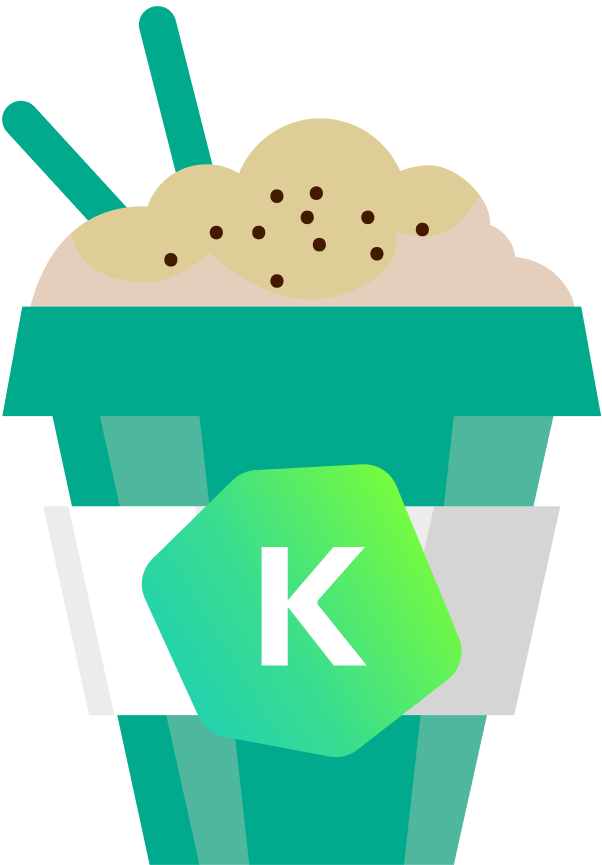

[](https://android-arsenal.com/details/1/7896)
[](http://androidweekly.net/issues/issue-383)
[](http://androidweekly.net/issues/issue-392)
[](https://search.maven.org/artifact/com.kaspersky.android-components/kaspresso)

[](https://t.me/kaspresso)
[](https://t.me/kaspresso_en)

# Kaspresso

Kaspresso — это фреймворк для тестирования пользовательского интерфейса Android. Он основан на [Espresso](https://developer.android.com/training/testing/espresso) и [UI Automator](https://developer.android.com/training/testing/ui-automator) и предоставляет широкий спектр дополнительных функций, таких как:

* 100% стабильность, отсутствие флаков.
* Поддержка Jetpack Compose **[Ранний доступ]**.
* Значительно ускорено выполнение команд UI Automator. С Kaspresso некоторые команды UI Automator выполняются **в 10 раз быстрее**!
* Отличная читаемость благодаря человеческому DSL.
* Полезный механизм перехватчиков, позволяющий перехватывать все действия и проверки в одном месте.
* Полное ведение журнала.
* Возможность вызова команд ADB.
* Философия написания тестов пользовательского интерфейса, реализованная с помощью DSL.
* Предоставляет возможность скриншотинга.
* Поддержка Robolectric.
* Поддержка Allure.

И многое другое!


[//]: # (![Kaspresso]&#40;https://habrastorage.org/webt/dw/jh/9k/dwjh9kypjl637kxj8tiaxwjvtp0.png&#41;)

## Интеграция

Чтобы интегрировать Kaspresso в свой проект:
1. Включите репозиторий mavenCentral в корневой файл `build.gradle`:

```groovy
allprojects {
    repositories {
        mavenCentral()
    }
}
```

2. Добавьте зависимость в `build.gradle`:

```groovy
dependencies {
    androidTestImplementation 'com.kaspersky.android-components:kaspresso:<последняя_версия>'
    // Поддержка Allure
    androidTestImplementation "com.kaspersky.android-components:kaspresso-allure-support:<последняя_версия>"
    // Поддержка Jetpack Compose
    androidTestImplementation "com.kaspersky.android-components:kaspresso-compose-support:<последняя_версия>"
}
```

Если вы все еще используете старые библиотеки поддержки Android, мы настоятельно рекомендуем перейти на AndroidX.

Последняя версия с библиотеками поддержки Android:

```groovy
dependencies {
    androidTestImplementation 'com.kaspersky.android-components:kaspresso:1.0.1-support'
}
```

## Туториал *Новое*
Чтобы упростить изучение фреймворка, доступно пошаговое руководство на [нашем веб-сайте](https://kasperskylab.github.io/Kaspresso/ru/Tutorial/). 

## Возможности Kaspresso

### Читаемость

Нам нравится синтаксис, который [Kakao](https://github.com/KakaoCup/Kakao) применяет для написания тестов пользовательского интерфейса. Эта оболочка над Espresso использует подход Kotlin DSL, что делает код 
значительно короче и читабельнее. Можно увидеть разницу:

**Espresso**:
```kotlin
@Test
fun testFirstFeature() {
    onView(withId(R.id.toFirstFeature))
        .check(ViewAssertions.matches(
               ViewMatchers.withEffectiveVisibility(
                       ViewMatchers.Visibility.VISIBLE)))
    onView(withId(R.id.toFirstFeature)).perform(click())
}
```
**Kakao**:
```kotlin
@Test
fun testFirstFeature() {
    mainScreen {
        toFirstFeatureButton {
            isVisible()
            click()
        }
    }
}
```
Мы использовали тот же подход для разработки собственной оболочки над UI Automator и назвали ее *Kautomator*. Взгляните на код ниже:

**UI Automator**:
```kotlin
val instrumentation: Instrumentation = InstrumentationRegistry.getInstrumentation()
val uiDevice = UiDevice.getInstance(instrumentation)
val uiObject = uiDevice.wait(
    Until.findObject(
        By.res(
            "com.kaspersky.kaspresso.sample_kautomator",
            "editText"
        )
    ),
    2_000
)
uiObject.text = "Kaspresso"
assertEquals(uiObject.text, "Kaspresso")
```
**Kautomator**:
```kotlin
MainScreen {
    simpleEditText {
        replaceText("Kaspresso")
        hasText("Kaspresso")
    }
}
```
Поскольку Kakao и Kautomator предоставляют почти идентичные API, вам не нужно заботиться о том, что находится под капотом ваших тестов, будь то Espresso или UI Automator. С Kaspresso вы пишете тесты в едином стиле для обоих вариантов.

Однако, сами Kakao и Kautomator не помогут вам увидеть связь между тестом и соответствующим ему тестовым сценарием. Кроме того, длинный тест часто превращается в гигантский кусок кода, который невозможно разделить на более мелкие части.
Вот почему мы создали дополнительный Kotlin DSL, который упрощает чтение теста. 

См. пример ниже:

```kotlin
@Test
fun shouldPassOnNoInternetScanTest() =
    beforeTest {
        activityTestRule.launchActivity(null)
        ...
    }.afterTest {
        ...
    }.run {
        step("Open Simple Screen") {
            MainScreen {
                nextButton {
                    isVisible()
                    click()
                }
            }
        }
        step("Click button_1 and check button_2") {
            SimpleScreen {
                button1 {
                    click()
                }
                button2 {
                    isVisible()
                }
            }
        }
        step("Click button_2 and check edit") {
            SimpleScreen {
                button2 {
                    click()
                }
                edit {
                    flakySafely(timeoutMs = 7000) { isVisible() }
                    hasText(R.string.text_edit_text)
                }
            }
        }
        step("Check all possibilities of edit") {
            scenario(
                CheckEditScenario()
            )
        }
    }
```

### Стабильность 

Иногда ваш тест может выполняться успешно десять раз, а затем ломается на одиннадцатой попытке по какой-то загадочной причине. Это называется *флак(flakiness)*. 

Самая популярная причина ненадёжности — нестабильность библиотек UI-тестов, таких как Espresso и UI Automator. Чтобы устранить эту нестабильность, Kaspresso использует DSL обертки и [перехватчики](#Interceptors). 

### Ускорение библиотек тестов пользовательского интерфейса

Давайте посмотрим короткое видео, показывающее разницу между оригинальным UI Automator (справа) и ускоренным (слева).


Здесь предоставлено [краткое объяснение](https://kasperskylab.github.io/Kaspresso/ru/Wiki/Kautomator-wrapper_over_UI_Automator/#ui-automator), почему это возможно.

### Перехватчики

Мы разработали [перехватчики поведения Kaspresso](https://kasperskylab.github.io/Kaspresso/ru/Wiki/Kaspresso_configuration/#behavior-interceptors) (Kaspresso behavior interceptors) на основе [перехватчиков Kakao/Kautomator](https://kasperskylab.github.io/Kaspresso/ru/Wiki/Kaspresso_configuration/#kaspresso-kakaokautomator) для обработки сбоев.

Благодаря перехватчикам можно делать много полезных вещей, таких как:

* добавлять настраиваемые действия для каждой операции фреймворка, такие как запись журнала или создание снимка экрана;
* преодолеть ненадежные операции, повторно запустив неудачные действия, прокрутив родительский макет или закрыв системный диалог Android;

и многое другое (см. [руководство](https://kasperskylab.github.io/Kaspresso/ru/Wiki/Kaspresso_configuration/#kaspresso-kakaokautomator)).

### Запись читаемых логов
Kaspresso пишет собственные сообщения в журнал, подробные и читабельные:


### Возможность вызова команд ADB

Espresso и UI Automator не позволяют вызывать команды ADB из теста. Чтобы решить эту проблему, мы разработали AdbServer (см. [вики](https://kasperskylab.github.io/Kaspresso/Wiki/Executing_adb_commands/)).

### Возможность работы с системой Android

Вы можете использовать классы Kaspresso для работы с системой Android.

Например, с помощью класса ```Device``` вы можете:

* отправлять/получать файлы с устройства,
* включить/отключить сеть,
* выдавать разрешения, как это делает пользователь,
* эмулировать телефонные звонки,
* делать скриншоты,
* включать/отключать GPS,
* устанавливать геолокацию,
* включать/отключать специальные возможности,
* изменять язык приложения,
* собирать и анализировать вывод logcat.

(подробнее о [Device class](https://kasperskylab.github.io/Kaspresso/ru/Wiki/Working_with_Android_OS/)).

### Предоставляет возможность скриншотинга

Если вы разрабатываете приложение, доступное по всему миру, вам необходимо *локализировать* его на разные языки. Когда интерфейс локализован, для переводчика важно увидеть контекст слова или фразы на конкретном экране. 

С Kaspresso переводчики могут автоматически делать скриншот любого экрана. Это невероятно быстро, даже для устаревших экранов, и не требует дополнительного рефакторинга (см. [руководство](https://kasperskylab.github.io/Kaspresso/Wiki/Screenshot_tests/)).

### Конфигурируемость

Вы можете настроить любую часть Kaspresso ([подробнее](https://kasperskylab.github.io/Kaspresso/ru/Wiki/Kaspresso_configuration/)).

### Поддержка Robolectric 

Вы можете запускать свои UI-тесты в среде JVM. Кроме того, почти все перехватчики, улучшающие стабильность, читабельность и другие, будут работать. 
Читать [подробнее](https://kasperskylab.github.io/Kaspresso/ru/Wiki/Kaspresso_Robolectric/). 

### Поддержка Allure

Kaspresso может генерировать очень подробные Allure-отчеты для каждого теста:

Более подробная информация доступна [здесь](https://kasperskylab.github.io/Kaspresso/ru/Wiki/Kaspresso_Allure/). 

### Поддержка Jetpack Compose (ранний доступ)

Теперь вы можете писать свои тесты Kaspresso для экранов Jetpack Compose! DSL и все принципы одинаковы. 
Таким образом, вы не увидите никакой разницы между тестами для View и для экранов Compose.
Более подробная информация доступна [здесь](https://kasperskylab.github.io/Kaspresso/ru/Wiki/Jetpack_Compose/).

** Имейте в виду, что это ранний доступ, который может содержать ошибки. Также возможно изменение API, но мы будем стараться этого не делать. Не стесняйтесь сообщать о багах в разделе issue, если вы столкнулись с какой-либо проблемой.**

## Философия

Сам инструмент, даже идеальный, не может решить всех проблем написания UI-тестов. Важно знать, как писать тесты и как организовать весь процесс. 
Наша команда имеет большой опыт внедрения автотестов в разных компаниях. Мы поделились своими знаниями на [Wiki](https://kasperskylab.github.io/Kaspresso/ru/Wiki/).

## Вики
Для получения всей информации посетите [Kaspresso wiki](https://kasperskylab.github.io/Kaspresso/ru/Wiki/)

## Примеры
Все примеры доступны в папке [samples](https://github.com/KasperskyLab/Kaspresso/tree/issue-372/tutorial/samples). 

Для большинства примеров требуется AdbServer. Чтобы запустить AdbServer, вы должны сделать следующие шаги:

1. Перейдите в папку `Kaspresso`.
```
cd ~/Workspace/Kaspresso
```
2. Запустите файл adbserver-desktop.jar.
```
java -jar artifacts/adbserver-desktop.jar
```

## Существующие проблемы
Все существующие проблемы в Kaspresso можно найти [здесь](https://kasperskylab.github.io/Kaspresso/ru/Issues/).

## Критические изменения 
Критические изменения можно найти [здесь](https://kasperskylab.github.io/Kaspresso/ru/Home/Breaking-changes/)

## Внести свой вклад
Kaspresso — это проект с открытым исходным кодом, поэтому вы можете внести свой вклад. См. [рекомендации](https://kasperskylab.github.io/Kaspresso/ru/Home/Contribution_guide/)).

## Лицензия
Kaspresso доступен по [Лицензии Apache, версия 2.0](https://github.com/KasperskyLab/Kaspresso/blob/master/LICENSE).
